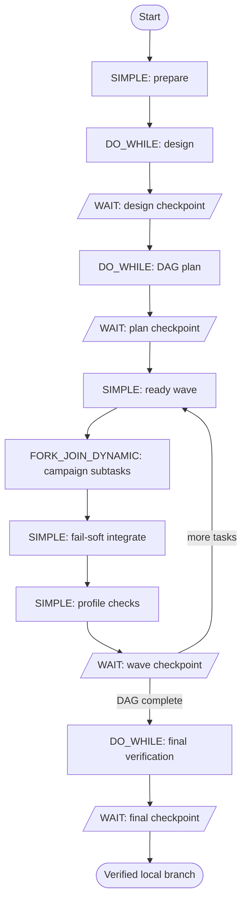

# Workflows

## Choose a workflow

| Intent | Workflow | Required inputs |
|---|---|---|
| Turn a GitHub issue into a pull request | `issue_to_pr` | `repo`, `issueNumber` |
| Review a pull request and post findings | `pr_review` | `repo`, `prNumber` |
| Review local changes before a commit | `local_review` | `repoPath` |
| Address existing PR feedback | `address_pr` | `repo`, `prNumber` |
| Implement a multi-part local change | `code_parallel` | `repoPath`, `instruction` |
| Run a long-lived, interactive complex feature campaign | `feature_campaign` | `repoPath`, `instruction` |
| Implement an apply-ready OpenSpec change | `openspec_development` | `repoPath`, `specSource`, `changeId` |
| Smoke-test GitHub connectivity | `github_demo` | `repoUrl`, `instruction` |

`design_docs` and `code_subtask` are internal sub-workflows. Let `code_parallel` invoke them.

For the complete, definition-backed contract—including every optional input and its exact
default—see [Workflow input reference](workflow-inputs.md). An input is required only when it
has no `inputTemplate` default in the registered workflow definition.

Implementation workflows use isolated worktrees. `code_parallel` requires a local `repoPath`;
the GitHub workflows clone from `repo`, and `local_review` intentionally reads the supplied
checkout directly. `keepWorktree` is available only on workflows that list it in the input
reference.

## Local review

`local_review` is intentionally the exception to the isolated-worktree rule: it accepts the
existing checkout directly so it can review staged, unstaged, untracked, and locally committed
changes before a commit. It fetches the selected baseline (`origin/main` by default) and compares
the checkout to that remote branch. The agent has only `Read`, `Grep`, and `Glob`; the workflow
does not create a worktree, alter files, stage, commit, push, or post review comments.

```bash
conductor workflow start --workflow local_review -i '{
  "repoPath":"/absolute/path/to/repo",
  "baseRemote":"origin",
  "baseBranch":"main"
}'
```

## OpenSpec development

`openspec_development` treats the selected OpenSpec change as the authoritative development
contract. `specSource` may be a local path (including `.` for the target repository), a Git
remote, or a public HTTPS `.zip`, `.tar.gz`, or `.tgz`. Set `specRef`/`specPath` when needed.
Set `useSpecSourceWorkspace:true` to make a local checked-out spec source the implementation
repository: Conductor creates an isolated worktree there, materializes only the selected OpenSpec
tree, commits the verified implementation and archive, then pushes a draft PR. The original
checkout is never edited. URL bundles also require `specWritebackRepo`; secrets remain in the worker environment or `gh`
credential store, never in workflow inputs.

```text
resolve + validate → assess repository + DAG → auto route
  ├─ small, dependency-free, file-disjoint → code_parallel
  └─ dependent, risky, or multi-wave       → feature_campaign
→ final profile checks → requirement verification → complete tasks → archive
```

The default `executionMode:auto` is deterministic; `parallel` and `campaign` are explicit
overrides, but an unsafe forced parallel plan is rejected. Same-repo changes archive on the
verified implementation branch. External GitHub spec repositories get a dedicated archive
branch and draft PR. Only apply-ready changes are accepted; proposal authoring is intentionally
outside this v1 workflow.

## Feature campaigns

`feature_campaign` is the checkpoint-first path for work that may take hours or days:

```text
prepare → design ↔ review → DAG plan ↔ review
        → [ready wave → integrate → checks → review]*
        → final real-system verification → final review → verified branch
```



Each checkpoint supports Continue, Revise with feedback, Adopt edits made in the worktree,
Run checks, Set profiles, Stop, or Later. Later leaves the WAIT task open; Stop retains the
branch with an `incomplete` outcome. Blocking checks and failed integrations prevent Continue.
The workflow never pushes or opens a PR.

Plans use `{id, description, dependsOn, files, acceptanceCriteria, checks}`. The scheduler
validates dependencies/cycles and runs only dependency-ready, file-disjoint work up to
`maxParallelism`. Per-agent defaults are 500 turns and $50; usage is cumulative with no
aggregate campaign cap.

Checks live at `.conductor-code/checks.json` using version 2. Profiles select named check IDs.
Environments are `none`, `managed` (`up`, `readyCheck`, `down` with teardown in `finally`), or
`attached` (`readyCheck`, environment-variable names only). Attached runs require a fresh HUMAN
confirmation and are never torn down by the harness.

## Design gate

For `code_parallel`, `issue_to_pr`, and the parallel `address_pr` engine, explicitly choose
`design:true` or `design:false`.

With design enabled, `design_docs` runs a bounded author/review loop. Human review is the default:
Approve continues to coding; Request changes submits editable feedback for another design pass.
Set `designHumanApproval:false` to use the structured, read-only `coding_agent` judge instead.
It reads the design documents with only `Read`, `Grep`, and `Glob`, then returns schema-validated
`approved` and `feedback` fields without modifying the repository.

## Backends and limits

Use `claude` (default), `codex`, or `gemini`. `code_parallel` can use different planning and coding
backends through `planAgent` and `codeAgent`. Shipped workflow defaults use at least 250 turns and a
`$50` maximum budget for every applicable agent task. Planning, parallel coding, and design-author
sessions in `code_parallel` default to 500 turns. Override these caps only intentionally.

Turn and spend caps are agent limits, not wall-clock deadlines. Runtime timeouts belong only to
the referenced Conductor task definition. There is no workflow `timeoutS` input and no secondary
worker/backend deadline.

## Publication gates

The TUI defaults to review gates before posting a PR review or opening an issue-resolution PR.
Raw CLI/API runs default those publication gates off unless `approve:true` (`pr_review`) or
`approvePr:true` (`issue_to_pr`) is supplied.

## GitHub automation sweeps

`pr_review_sweep`, `pr_address_sweep`, and `issue_resolution_sweep` scan GitHub, claim a bounded
set of revision keys, dynamically fan out `automation_dispatch`, and return after child starts.
Claims are hidden versioned GitHub comments trusted only from the configured identity. Review
keys are head SHAs; feedback keys hash external review, inline, and conversation comments;
issues require the default `conductor:auto` label and no linked open/merged PR. Active children
retain claims indefinitely; failures retry after 30 minutes up to three attempts.

Use `docs/config/automation-schedule.example.json` as a starting payload. Registration never
creates schedules automatically.

## Registration

After changing definitions:

```bash
./run.sh register
```

Registration updates sub-workflows first and verifies every SIMPLE task has a registered task
definition. A workflow that reaches an unregistered SIMPLE task will wait indefinitely.
