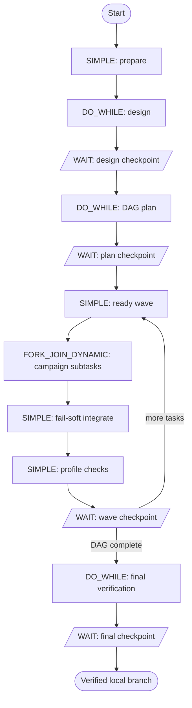

# Workflows

## Choose a workflow

| Intent | Workflow | Required inputs |
|---|---|---|
| Turn a GitHub issue into a pull request | `issue_to_pr` | `repo`, `issueNumber` |
| Review a pull request and post findings | `pr_review` | `repo`, `prNumber` |
| Review local changes before a commit | `local_review` | `repoPath` |
| Address existing PR feedback | `address_pr` | `repo`, `prNumber` |
| Implement a multi-part local change | `code_parallel` | `repoPath`, `instruction` |
| Run a long-lived, interactive complex feature campaign | `feature_campaign` | `repoPath`, `instruction`; set `createPr: true` to publish a PR |
| Implement an apply-ready OpenSpec change | `openspec_development` | `specSource`, `changeId` (plus `repoPath` except local-source-workspace mode) |
| Smoke-test GitHub connectivity | `github_demo` | `repoUrl`, `instruction` |
| Prove build runtimes on both worker pools | `runtime_health` | none |

`design_docs` and `code_subtask` are internal sub-workflows. Let `code_parallel` invoke them.

For the complete, definition-backed contract—including every optional input and its exact
default—see [Workflow input reference](workflow-inputs.md). An input is required only when it
has no `inputTemplate` default in the registered workflow definition.

Implementation workflows use isolated worktrees. `code_parallel` requires a local `repoPath`;
the GitHub workflows clone from `repo`, and `local_review` intentionally reads the supplied
checkout directly. `keepWorktree` is available only on workflows that list it in the input
reference.

For `code_parallel`, every completed merge is committed back to the supplied `repoPath` before
verification. Verification is diagnostic: a failed or exhausted verification loop is returned in
the output and does not revert, hide, or withhold the source checkout's candidate commit. Read
`sourceHandoff` in the workflow output for the exact path, branch, and commit to review.

## Running tests

`test_cycle` is the one sub-workflow that runs a repository's tests. Every workflow that needs a
test result embeds it rather than discovering and running commands itself:

```text
code_subtask   → targeted, 1 fix   (per subtask, before its branch is merged)
code_parallel  → targeted          (after the merge, before the handoff)
address_pr     → full              (before publication)
issue_to_pr    → full              (the pre-PR gate)
feature_campaign → full            (after the final commit; a red suite forces a draft PR)
```

`targeted` derives an exact-test or affected-unit plan from the candidate's diff. `full` runs the
repository-wide suite and, with `allowHeavySuites`, may include integration and end-to-end
targets. The command itself comes from the first source that has one: the caller's `testCommands`,
then a repository guide, then `.conductor-code/verification.json`, then build-system inference.

It runs up to five times and fixes between runs, so the last run is always a verdict. **It never
fails** — every outcome, including an unfixable failure or an unavailable verifier, completes with
a `testCycleState` the caller branches on. See
[Workflow input reference](workflow-inputs.md) for the full state list.

Discovery and execution run only on the isolated verification worker
(`WORKER_MODULES=verification`), so a coding worker can never satisfy its own gate. Tests execute
in a disposable detached clone at the exact candidate commit, never in the working tree, and a
dependency install runs first for toolchains whose test runner lives in the project rather than
on the host.

## Local review

`local_review` is intentionally the exception to the isolated-worktree rule: it accepts the
existing checkout directly so it can review staged, unstaged, untracked, and locally committed
changes before a commit. It fetches the selected baseline (`origin/main` by default) and compares
the checkout to that remote branch. The agent has only `Read`, `Grep`, and `Glob`; the workflow
does not create a worktree, alter files, stage, commit, push, or post review comments.

```bash
conductor workflow start --workflow local_review -i '{
  "repoPath":"/absolute/path/to/repo",
  "baseRemote":"origin",
  "baseBranch":"main"
}'
```

## OpenSpec development

`openspec_development` treats the selected OpenSpec change as the authoritative development
contract. `specSource` may be a local path (including `.` for the target repository), a Git
remote, or a public HTTPS `.zip`, `.tar.gz`, or `.tgz`. Set `specRef`/`specPath` when needed.
Set `useSpecSourceWorkspace:true` to make a local checked-out spec source the implementation
repository: Conductor creates an isolated worktree there, materializes only the selected OpenSpec
tree, commits the verified implementation and archive, then pushes a draft PR. The original
checkout is never edited. See the [local OpenSpec guide](openspec.md) for source modes, writeback
rules, and safety boundaries. URL bundles require `specWritebackRepo`; secrets remain in the
worker environment or `gh` credential store, never in workflow inputs.

```text
resolve + validate → assess repository + DAG → auto route
  ├─ small, dependency-free, file-disjoint → code_parallel
  └─ dependent, risky, or multi-wave       → feature_campaign
→ final profile checks → requirement verification → complete tasks → archive
```

The default `executionMode:auto` is deterministic; `parallel` and `campaign` are explicit
overrides, but an unsafe forced parallel plan is rejected. Same-repo changes archive on the
verified implementation branch. External GitHub spec repositories get a dedicated archive
branch and draft PR. Only apply-ready changes are accepted; proposal authoring is intentionally
outside this v1 workflow.

## Feature campaigns

`feature_campaign` is the checkpoint-first path for work that may take hours or days:

```text
prepare → design ↔ review → DAG plan ↔ review
        → [ready wave → integrate → checks → review]*
        → final real-system verification → final review → verified branch
```


```mermaid
flowchart TD
  start([Start]) --> prepare[SIMPLE: prepare]
  prepare --> design[DO_WHILE: design]
  design --> design_gate[/WAIT: design checkpoint/]
  design_gate --> plan[DO_WHILE: DAG plan]
  plan --> plan_gate[/WAIT: plan checkpoint/]
  plan_gate --> schedule[SIMPLE: ready wave]
  schedule --> fork[FORK_JOIN_DYNAMIC: campaign subtasks]
  fork --> integrate[SIMPLE: fail-soft integrate]
  integrate --> checks[SIMPLE: profile checks]
  checks --> wave_gate[/WAIT: wave checkpoint/]
  wave_gate -->|more tasks| schedule
  wave_gate -->|DAG complete| final_verify[DO_WHILE: final verification]
  final_verify --> final_gate[/WAIT: final checkpoint/]
  final_gate --> done([Verified local branch])
```

Each checkpoint supports Continue, Revise with feedback, Adopt edits made in the worktree,
Run checks, Set profiles, Stop, or Later. Later leaves the WAIT task open; Stop retains the
branch with an `incomplete` outcome. Blocking checks and failed integrations prevent Continue.
The workflow never pushes or opens a PR.

Plans use `{id, description, dependsOn, files, acceptanceCriteria, checks}`. The scheduler
validates dependencies/cycles and runs only dependency-ready, file-disjoint work up to
`maxParallelism`. Per-agent defaults are 500 turns and $50; usage is cumulative with no
aggregate campaign cap.

Checks live at `.conductor-code/checks.json` using version 2. Profiles select named check IDs.
Environments are `none`, `managed` (`up`, `readyCheck`, `down` with teardown in `finally`), or
`attached` (`readyCheck`, environment-variable names only). Attached runs require a fresh HUMAN
confirmation and are never torn down by the harness.

## Design gate

For `code_parallel`, `issue_to_pr`, and the parallel `address_pr` engine, explicitly choose
`design:true` or `design:false`.

With design enabled, `design_docs` runs a bounded author/review loop. Human review is the default:
Approve continues to coding; Request changes submits editable feedback for another design pass.
Set `designHumanApproval:false` to use the structured, read-only `coding_agent` judge instead.
It reads the design documents with only `Read`, `Grep`, and `Glob`, then returns schema-validated
`approved` and `feedback` fields without modifying the repository.

## Backends and limits

Use `claude`, `codex`, or `gemini`. `code_parallel` can use different planning and coding
backends through `planAgent` and `codeAgent`; leave them blank to retain the selected policy role.
Shipped workflow defaults use at least 250 turns and a
`$50` maximum budget for every applicable agent task. Planning, parallel coding, and design-author
sessions in `code_parallel` default to 500 turns. Override these caps only intentionally.

See [models and profiles](model-profiles.md) for policy precedence, backend fallback, and cost
labels. See [prompt templates](templates.md) for prompt-source precedence and reusable role guidance.

Turn and spend caps are agent limits, not wall-clock deadlines. There is no workflow, task-definition,
worker, backend, subprocess, or HTTP execution deadline.

## Publication gates

The TUI defaults to review gates before posting a PR review or opening an issue-resolution PR.
At a PR-review gate, **Approve PR** submits the displayed findings with event APPROVE;
**Request changes** posts the human feedback with event REQUEST_CHANGES and does not approve;
**Investigate further** privately resumes the read-only reviewer with a separate question and
returns a refreshed complete draft; **Later** leaves the WAIT open and publishes nothing. The
default investigation limit is five and its history is durable. A clean drafted review is exactly `LGTM`.
Raw CLI/API `issue_to_pr` runs gate only when `approvePr:true`; `address_pr` always reviews the
verified candidate before it can update the remote branch. At a coding gate, **Approve** publishes
the displayed verified candidate, **Request code changes** revises that same candidate workspace
and re-runs verification before returning to the gate, **Stop** records suppression with no remote
mutation, and **Later** leaves the WAIT open. Design and OpenSpec gates use explicit design/plan
labels and expose their generated files.

Code-candidate revision loops are bounded by `maxApprovalRevisions`. `address_pr` delegates every push and success comment to
`publish_verified_pr`, which checks the exact local candidate and unchanged remote PR head, pushes
once, and posts success only after exact-SHA CI passes. Empty CI means pending; failed, unknown, or
exhausted CI produces a terminal `ci_blocked` outcome rather than another resumable WAIT.

## GitHub automation sweeps

`pr_review_sweep`, `pr_address_sweep`, and `issue_resolution_sweep` scan GitHub, claim a bounded
set of revision keys, dynamically fan out `automation_dispatch`, and return after child starts.
Claims are hidden versioned GitHub comments trusted only from the configured identity. Review
keys are head SHAs; feedback keys hash external review, inline, and conversation comments;
issues require the default `conductor:auto` label and no linked open/merged PR. Active children
retain claims indefinitely; failures retry after 30 minutes up to three attempts.

Use `docs/config/automation-schedule.example.json` as a starting payload. Registration never
creates schedules automatically.

## Registration

After changing definitions:

```bash
./run.sh register
```

Registration updates sub-workflows first, validates every static and generated sub-workflow version
pin against its local definition, and verifies every SIMPLE task has a registered task definition.
A workflow that reaches an unregistered SIMPLE task will wait indefinitely. Run
`scripts/validate_live_paths.py` after registration to exercise the safety-critical approval,
revision, branch-drift, and exact-SHA CI paths in the live Conductor decision engine without
touching a repository or GitHub.
