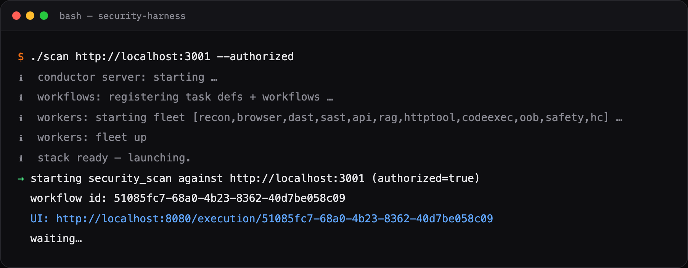
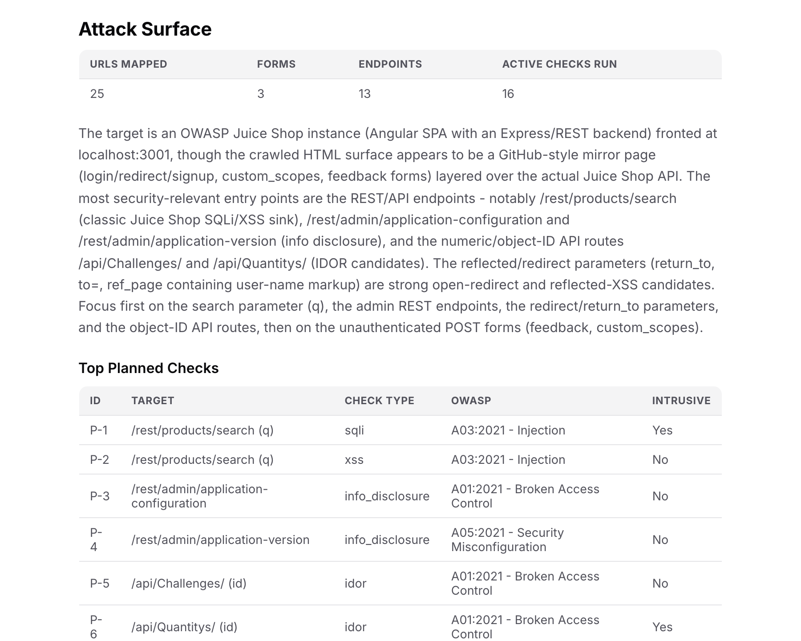
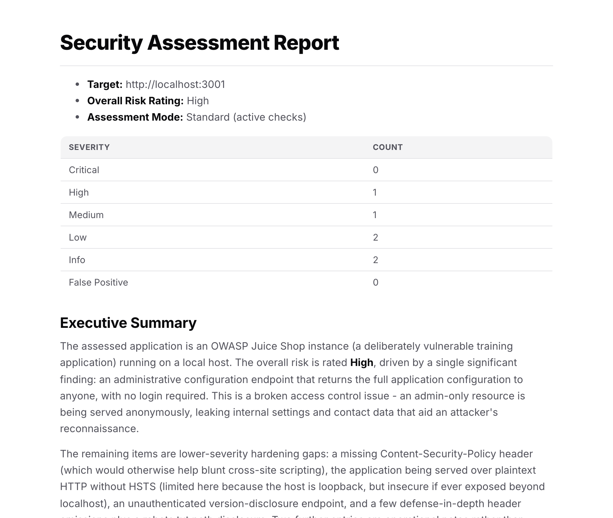
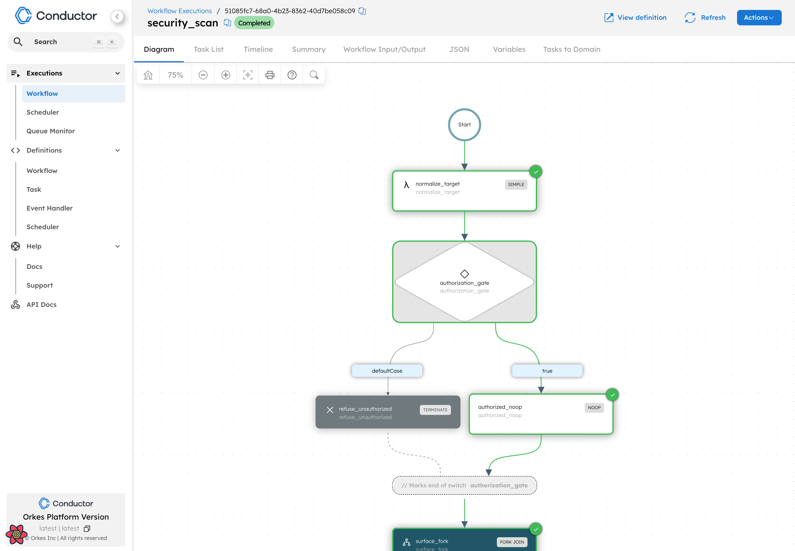
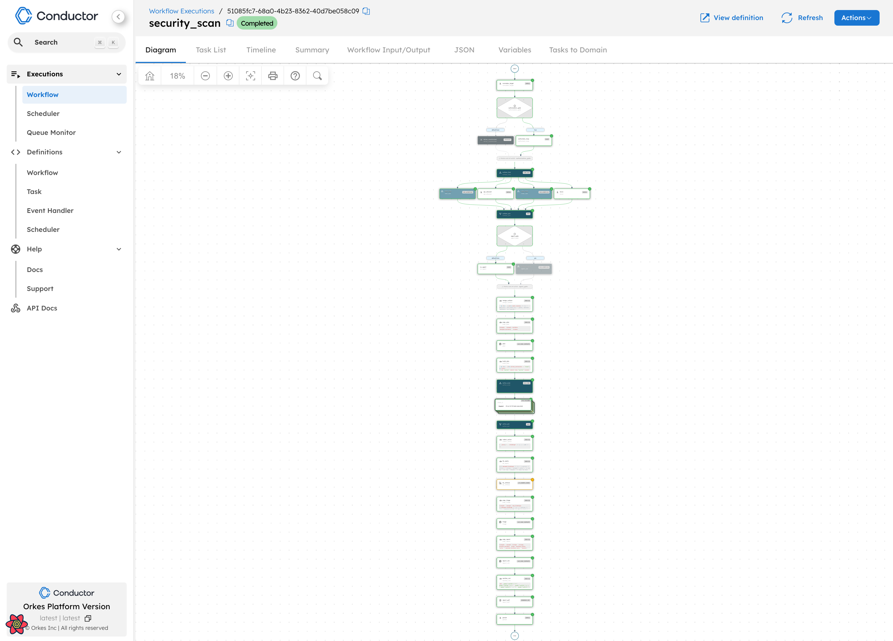

# We built an AI pentester that assumes it's wrong until proven right

Point an LLM at a web app and ask it to find vulnerabilities, and it will happily oblige. It will produce a confident, well-formatted list of "critical" issues — SQL injection here, an IDOR there, a leaked secret over there. Some will be real. Many will be plausible fiction: a `200 OK` mistaken for an exploit, a masked value read as a leak, a traversal "confirmed" by a sentence in the model's own narrative rather than by evidence.

That's the actual problem with AI in security. Generating candidate bugs is easy — models are good at pattern-matching a request into a hypothesis. The hard part, the part that decides whether a tool is useful or just a new source of alert fatigue, is **believing** the findings. An autonomous scanner that hands you fifty confident-but-unverified claims hasn't saved you work; it's moved the triage burden onto you and dressed it up as automation.

So when we built **Security Harness** — an open-source autonomous web and API penetration tester, and the first production-ready agent in the [`conductor-agents`](https://github.com/conductor-oss/conductor-agents) catalog — we started from the opposite posture. The agent assumes every finding it produces is wrong until it can prove otherwise. This post is about how it does that, and why we think "prove it or drop it" is the feature that matters most.

## What it actually is

Security Harness is an autonomous pentester orchestrated by [Conductor](https://conductor-oss.org). You point it at a target; it crawls the app with a real browser, reasons about the attack surface with an LLM, runs a battery of scanners in parallel, **actively exploits** what it finds, and adversarially verifies each result before it writes a report — all as a durable, observable, retryable workflow. Optionally, you also hand it the source code, and it mines that (SAST plus route extraction) to seed more to test.

It is not a scanner with a chat wrapper. A scanner runs a fixed battery of signatures once and reports whatever matched. Security Harness runs a reasoning loop: it forms hypotheses, attempts them using the application's own features, and then tries to tear its own results apart.


*One command boots the Conductor stack, starts the worker fleet, and launches the scan — every run is a workflow you can open live in the Conductor UI.*

> 🎥 **Screencast placeholder** — a ~90-second walkthrough of a full run (crawl → plan → exploit → verify → report) drops in here.

## The closed adversarial loop

At its core the harness runs an OODA / scientific-method loop, driven by an LLM agent with real tools. Two fixed bookends wrap an iterated core:

```text
UNDERSTAND ─▶ HYPOTHESIZE ─▶ EXPLOIT ─▶ VERIFY ─▶ REFLECT ─▶ REPORT
```

- **Understand** — build a model of the target: surface, docs, dependencies, CVE leads.
- **Hypothesize** — propose *falsifiable* attacks tied to specific security objectives and user personas.
- **Exploit** — attempt the attack using the app's own features, not just probe strings.
- **Verify** — adversarially refute the result; confirm blind bugs out-of-band.
- **Reflect** — decide the next pass from coverage gaps and the findings already confirmed.
- **Report** — triage, attack-graph dossier, residual-risk statement.

The loop is multi-pass and goal-directed. A confirmed finding doesn't just get logged — it becomes a *precondition* that seeds deeper, chained hypotheses. The agent pursues a kill chain rather than emitting a flat list of independent issues. That's the structural difference from a signature battery: the harness reasons about what a confirmed bug *unlocks*, and steers the next pass at what it hasn't yet covered.


*UNDERSTAND → HYPOTHESIZE on a real OWASP Juice Shop run: the agent maps the surface, then plans checks tied to specific endpoints and OWASP categories before it touches anything.*

## How it earns trust

This is the part that makes or breaks an AI pentester, so it gets the most machinery.

**Every candidate is refuted, not confirmed.** The exploit step produces a *claim*. A separate verification step then tries to knock that claim down, and it is biased toward disbelief: under uncertainty it defaults to **rejected**. A finding survives only if the evidence forces it to. This inverts the usual failure mode, where a model talks itself into a conclusion because the tokens flow that way.

**Blind bugs have to call home.** For a whole class of vulnerabilities — server-side request forgery, remote code execution, blind injection — a `200 OK` proves nothing; the interesting behavior happens server-side, where you can't see it. The harness confirms these with an out-of-band collaborator: a vector is marked **confirmed** only when the target actually calls back to an external listener the agent controls, or there's separate, unambiguous in-band proof. Anything short of that stays an explicit *unconfirmed lead* — surfaced so you can chase it, never dressed up as a finding.

Here's what that discipline looks like in practice. On a production SaaS target we regularly run the harness against, it confirmed a **server-side request forgery** via an IPv6-loopback egress bypass. The cluster's outbound filter was a string denylist: it blocked `127.0.0.1` and `localhost`, but the equivalent IPv6 loopback `[::1]` slipped through and reached an internal backend that was never meant to be externally reachable. The agent didn't declare victory on a suggestive response. It proved the bug with a **differential**: the blocked forms returned the filter's rejection, the bypass form returned a real internal response body, and a request to a port with *nothing listening* returned a connection-refused error — demonstrating a genuine server-side outbound connection rather than a reflected echo of the input.

And then it did the thing we care about most: it **capped the severity honestly**. The finding was rated High, not Critical, because the highest-value internal endpoints it could reach were still protected by their own auth. No inflation to make the report look scarier.

The clearest proof of the posture, though, is what the same run **threw away**. It had drafted a "cleartext secret leak" — then rejected it, because replaying the proof-of-concept showed the value was masked and the "leaked" data was the caller reading its own record, not another tenant's. It had drafted a "path traversal" — then rejected it, because the smoking-gun evidence existed in the narrative but not in the actual evidence chain. A tool optimized for an impressive findings count keeps those. A tool optimized for trust deletes them, and it did.

It's also honest about what it *didn't* do. Every report states its coverage against the objective catalog in plain terms — "N of 31 objectives tested" — and says so explicitly: **absence of findings is not assurance**. A clean report tells you what was checked, not that the app is safe.


*The report from a real Juice Shop run: a confirmed broken-access-control finding drives the risk rating, the severity counts are sober, and the summary spells out which classes were **not** confirmed and why that isn't a clean bill of health.*

## Fails closed by construction

An agent that actively exploits things needs hard limits, and "we prompted it to be careful" is not a limit. Security Harness enforces authority mechanically.

Every action carries a required **capability level, 0 through 4**, and the run has a ceiling. Level 1 — the default — is effectively read-only: writes and code execution are refused at the gate. Higher levels unlock state-changing tests, but only on synthetic, prefixed objects the agent creates and then cleans up. The harness **cannot raise its own ceiling**; a worker refuses any action above the manifest's limit, full stop.

For real engagements you supply an authorization manifest: approvers, in-scope hosts, a testing window, rate and data-volume budgets, allowed techniques, and forbidden operations. It's validated at startup and **fails closed** — if it's malformed or missing, nothing runs. An independent safety governor can halt the campaign on window expiry, a kill-switch file, or a budget breach, and every action lands in a tamper-evident audit log.

The same rigor shows up in how it reasons about authorization bugs. Cross-tenant and BOLA testing require *two* identities, because the only honest confirmation of a cross-tenant read is reading *another* tenant's distinctive data — not your own. Give the harness a single credential and it will structurally refuse to claim "no cross-tenant issue," because it has no way to prove one either way. That's the same principle as the rejected "secret leak" above, enforced at the level of what the agent is even allowed to conclude.

## Why a durable workflow engine

Security scans are long-running, massively parallel, and failure-prone — which is exactly the problem Conductor was built for, and why the harness runs as a Conductor workflow rather than a script.


*The same run in the Conductor UI. The authorization gate is a first-class `SWITCH` step: without authorization the workflow routes straight to `TERMINATE` — "fails closed," enforced by the graph itself, not by a prompt.*

- **Durable execution** means a crashed worker or a flaky scanner is retried without losing the campaign. State lives in the server, not in a process that might die forty minutes into a run.
- **`FORK_JOIN_DYNAMIC`** fans out one branch per hypothesis. The agent doesn't know how many hypotheses it will have until the LLM plans them, so the parallelism is decided at runtime — a fixed fork can't express that.
- **`DO_WHILE` + `LLM_CHAT_COMPLETE`** are the ReAct loops themselves: reason, act, observe, repeat, with a bounded number of iterations.
- **Observability** is free: every decision, tool call, and retry is a first-class step you can watch live in the Conductor UI, and `GENERATE_PDF` turns the confirmed findings into a report artifact.


*The full `security_scan` pipeline, completed. Surface gathering runs recon, crawl, API discovery and SAST in parallel (`FORK_JOIN`); the active-scan phase fans out one branch per planned check (`FORK_JOIN_DYNAMIC`); then plan → triage → report. Every box is a first-class, retryable step in the graph.*

The loop also **steers itself as it runs**. Between passes, a reflection step reads what's been confirmed and where coverage is still thin and sets the focus for the next pass; within a single sink, each failed exploit attempt carries forward *why* it failed, so the next attempt escalates instead of repeating. A stateful, multi-pass, self-directed campaign like that only holds together because its state lives durably in the workflow — not in a process that has to survive the next hour on its own.

Underneath the loop is a **Security Objective Catalog** — 31 objectives across nine families (confidentiality, integrity, availability, infrastructure, authentication, authorization, cryptography, client-side, and detection). It's the spine the whole system reasons against: hypotheses map to objectives, and coverage is reported against them. It's also what the "N of 31 tested" honesty line measures.

## Getting better without gaming itself

A tool that assumes it's wrong is, oddly, well positioned to improve — because you already keep the ground truth to grade it against. So alongside the harness we built a self-improvement loop that learns from its own history: it mines the trace corpus accumulated across many runs, clusters recurring failure signatures (a technique that keeps getting blocked, a sink it keeps abandoning too early), and proposes small, bounded changes to its own tactics.

The interesting part isn't that "the AI improves itself." It's the constraints — because a self-tuning security tool is *exactly* where things go wrong. Left unchecked, an optimizer learns to inflate findings so its scores look better, or quietly tunes away the safety checks that slow it down. So the loop is fenced in hard:

- It may only edit a designated **`TACTICS` region** of a prompt, plus target profiles. The method core, the objective catalog, and the evidence bar — the machinery that decides what's *true* — are frozen or require human ratification. **Safety and authorization are never tunable.**
- A change is adopted only if it beats the current champion on a **held-out benchmark split**, by a statistically significant margin, **and** regresses nothing: the false-positive rate can't rise, no vulnerability class can lose recall, cost can't blow up. With too little ground truth to judge honestly, every proposed change downgrades to human review.
- Traces are treated as untrusted input (a target could try to poison them), so signatures must recur across independent runs before they count, and every promotion is a **signed, reversible edition** — a regression rolls straight back.

In other words, the loop is allowed to get better at *finding* things, measured against ground truth it can't see while it trains, and it's forbidden from touching the parts that keep it honest. Today this runs as offline tooling that drives Conductor scans for evaluation and learns from their traces; turning it into a hands-off, scheduled Conductor workflow is the next step.

## Try it

The harness is open source and runs locally in a couple of commands. Point it at a deliberately vulnerable app you own — OWASP Juice Shop is a good first target:

```bash
export ANTHROPIC_API_KEY=sk-ant-...
make venv                                   # one-time worker setup
make up                                     # start Juice Shop on :3001

./scan http://localhost:3001 --authorized   # auto-starts the full Conductor stack
#   → watch it live in the Conductor UI
#   → reports/<scan-id>/report.pdf + findings.json + report.sarif
```

For the deep, actively-exploiting pentest — the one that confirms bugs out-of-band and chains findings — use `./assess`, and hand it source with `--source` to seed the live tests.

> **Authorized testing only.** Only scan systems you own or have explicit written permission to test. Unauthorized scanning may be illegal, and you are responsible for how you use this.

## What's next

Security Harness is the first agent in the [`conductor-agents`](https://github.com/conductor-oss/conductor-agents) catalog, not the last — coding, research, and support agents are on the way, each a self-contained harness built on the same primitives. On the security side we're deepening per-sink exploitation and promoting the self-improvement loop above from offline tooling into a hands-off, scheduled Conductor workflow.

But here's the part worth underlining: **everything that makes this agent trustworthy is [Conductor](https://conductor-oss.org) doing the heavy lifting.** The multi-hour campaigns that survive a crashed worker — that's durable execution. The fan-out that matches however many hypotheses the LLM invents at runtime — `FORK_JOIN_DYNAMIC`. The verify-then-confirm loop, the capability gate, the tamper-evident audit trail — all modeled as first-class, replayable workflow steps you can watch live and inspect after the fact. We didn't hand-roll an orchestration layer and hope it held up under retries and parallelism; we described the agent and let Conductor run it.

That's the real takeaway. Serious agents are long-running, parallel, stateful, and failure-prone — which is exactly the problem Conductor was built to solve. It was built at Netflix to run mission-critical workflows at scale, and it's been open source ever since. If you're building agents that have to survive the real world, this is the foundation to start from:

- ⭐ **[Star Conductor on GitHub](https://github.com/conductor-oss/conductor)** — the durable backbone under every agent in this catalog.
- 📚 **[Explore the agent catalog](https://github.com/conductor-oss/conductor-agents)** — clone a harness, read it, run it in minutes.
- 🛡️ **[Run Security Harness](https://github.com/conductor-oss/conductor-agents/tree/main/security-harness)** against something you own, and see the loop work end to end.
